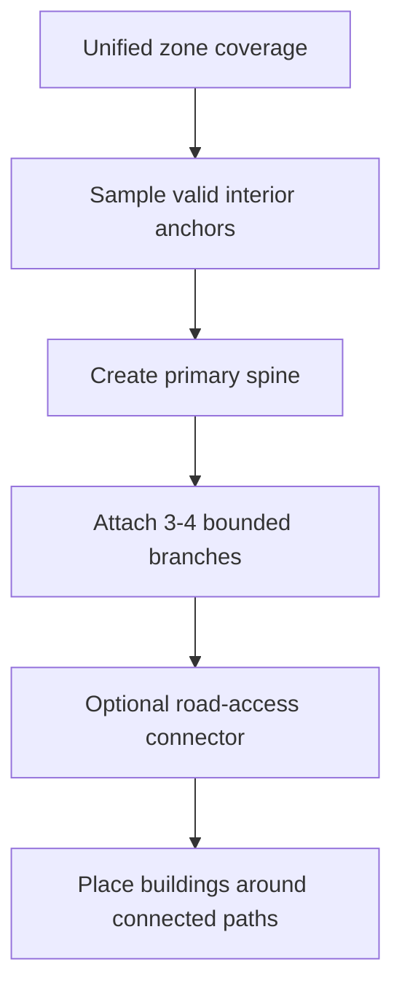

## Context

TownDraw stores zones as semantic brush-painted `ZoneSketch` objects and generates visual map content from `sketchObjects` without mutating the sketch. Recent testing with exported JSON showed that large painted districts now produce multiple internal paths, but those paths still read as separate strokes rather than a connected district circulation network. The same JSON also shows the root modeling issue: brush stamps are still too visible in generation behavior, making a zone feel like a set of overlapping circles instead of one drawn shape.

The editor should continue to use brush input because it is quick and organic, but downstream systems need a unified coverage abstraction: hit testing, rendering, effective-zone resolution, and generation should ask “is this point/segment inside the painted blob?” rather than reasoning about stamps independently.

## Goals / Non-Goals

**Goals:**

- Represent painted zone coverage as one continuous semantic shape for user-visible behavior.
- Keep existing JSON compatible by continuing to accept `brushStamps` while introducing helper APIs that treat them as merged coverage.
- Generate district paths as a connected branch skeleton before placing buildings, stalls, or industrial structures.
- Create a small, coherent street network for larger populated districts: a main spine plus a few connected branches rather than many detached segments.
- Place generated objects around those branches with clearance so the output reads as neighborhoods around streets.

**Non-Goals:**

- Replacing the brush UI with polygon editing.
- Adding external geometry libraries.
- Creating full city-planning simulation, traffic routing, or parcel subdivision.
- Changing import/export format incompatibly.

## Decisions

### Use unified zone coverage helpers instead of changing the persisted model first

Keep `ZoneSketch.brushStamps` as persisted input and centralize merged-blob behavior in zone coverage utilities. The utilities should expose point and segment checks that treat overlapping stamps as one continuous coverage area and can later be optimized without changing editor code.

Alternatives considered:

- **Persist a polygon/mesh immediately:** better conceptual model, but would require migration and editing work now.
- **Keep direct stamp loops everywhere:** minimal code change, but preserves the current circle-by-circle behavior.

### Plan district circulation before object placement

For village, market, and industrial zones, generation should first derive a connected path graph from the unified zone shape. Object placement then uses that graph as blocked/attractor geometry: objects stay clear of paths but are distributed near path corridors.

Alternatives considered:

- **Place objects first, route between them:** produces roads that depend on random preliminary placements and can leave disconnected or arbitrary segments.
- **Draw only access connectors from external roads:** fails when the district needs internal neighborhood streets.

### Model internal roads as a connected branch graph

The generator should build a small path graph with one primary spine and bounded branch count. Candidate branch endpoints are selected from valid coverage samples, then connected to the existing graph only if sampled segments remain inside the effective zone and avoid blockers.

Alternatives considered:

- **Independent axis chunks:** simple but can create disconnected streets.
- **Dense grid:** connected but visually too urban and not organic enough for the MVP.

### Keep generation deterministic

All sampling and branch decisions should remain seeded from zone id, zone index, and zone type. This preserves repeatable tests and stable regeneration for the same sketch.

## Risks / Trade-offs

- **Risk: Merged coverage checks become expensive for many brush stamps.** → Mitigate with bounded sampling, cached bounds, and helper functions that can later add raster/marching-squares acceleration.
- **Risk: Branch networks may be too sparse for very large zones.** → Mitigate with type-specific maximum branch counts and regression tests for large districts.
- **Risk: Roads may touch boundaries awkwardly in narrow shapes.** → Mitigate by validating sampled path segments and reducing branch count rather than forcing invalid connectors.
- **Risk: Existing JSON contains off-canvas zones.** → Preserve compatibility and avoid generating invalid content outside effective map constraints where current systems already reject placement.

## Migration Plan

- Existing projects continue to load because `brushStamps` remain valid.
- Generation behavior changes on regeneration; old `generatedObjects` in saved JSON remain importable but can be replaced by pressing `Generar mapa`.
- Rollback is possible by reverting the generator and coverage helper changes; no data migration is required.

## Open Questions

- Should future exports store a derived outline/polygon cache for performance, or keep it purely derived at runtime?
- Should the UI expose zone smoothing/brush size controls as a later change?
