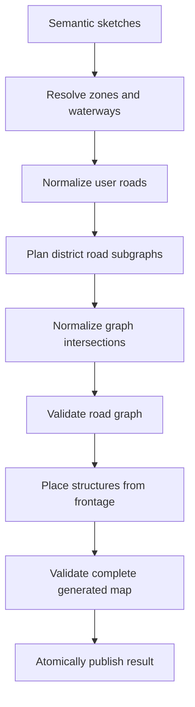

## Context

See `proposal.md` for motivation. The current generator stores roads and internal circulation as unrelated polylines and contains multiple partly superseded planning strategies in one service. Connection tests infer topology from coordinate proximity or geometric crossing, so the representation cannot distinguish a junction from an illegal crossing.

TownDraw remains a semantic editor: road and zone sketches are user-owned intent, while all generated data is replaceable. Polygonal zone coverage from `replace-zone-stamps-with-polygons` is the traversable-region input for this design. Angular Signals, PixiJS rendering, deterministic generation, river blockers, zone precedence, and sketch/generated separation remain constraints.

## Goals / Non-Goals

**Goals:**

- Make road topology explicit and independently validatable.
- Use one graph for normalized user roads and all generated district circulation.
- Produce connected district networks before placing structures.
- Make every surviving same-level crossing an explicit junction.
- Keep planning deterministic, bounded, and testable without visual rendering.
- Allow the implementation to remove legacy generated-road types and algorithms completely.

**Non-Goals:**

- Traffic simulation, turn restrictions, lane modeling, or navigation for agents.
- User-facing node-by-node road editing in this change.
- Road-road overpasses, tunnels, or automatic district bridges.
- Perfect computational geometry for arbitrary self-intersecting input.
- Preserving legacy generated-object ids or geometry across regeneration.

## Decisions

### Replace the generated object array with a generated map aggregate

Generated state will have two explicit parts:

```ts
interface GeneratedMap {
  schemaVersion: number;
  roadNetwork: RoadNetwork;
  objects: GeneratedNonRoadObject[];
}

interface RoadNetwork {
  nodes: RoadNode[];
  edges: RoadEdge[];
}
```

`RoadNode` contains a stable id, position, and kind such as endpoint, junction, portal, or bridge endpoint. `RoadEdge` references `fromNodeId` and `toNodeId`, contains its centerline points and width, and records a semantic class (`main`, `secondary`, `path`, `street`, `aisle`, or `service-road`), source sketch/district id, and optional bridge metadata.

Pixi rendering consumes edges; connectivity consumers use node references. Coordinates alone never establish connection.

Alternatives considered:

- **Add optional node ids to existing generated polylines:** preserves more code but keeps two competing road models and permits partially topological output.
- **Keep nodes only inside the planner and flatten before storage:** loses the invariants immediately after generation and makes import/render tests infer topology again.

### Build the map through explicit generation stages

Generation becomes an orchestrator over isolated stages:



The implementation should separate at least road models/geometry, road-sketch normalization, district planning, graph normalization, graph validation, structure placement, and top-level map orchestration. The existing generator may remain as the public entry point during integration, but it will not retain the current road helpers.

Alternative considered:

- **Incrementally call the existing organic and object-aware helpers:** rejected because they produce independent polylines and duplicate connection logic before a graph exists.

### Normalize user roads before generating districts

User road strokes are segmented and analyzed together. Valid segment crossings create deterministic junction nodes and split both roads. An endpoint sufficiently near another segment projects onto that segment and creates a shared node. Points outside tolerance remain disconnected.

Road/river order is resolved during this stage. A surviving bridge span belongs to the road graph and carries bridge metadata; a later river removes the blocked span and leaves explicit terminal nodes on each side.

Node merging uses one documented tolerance derived from road width, deterministic tie-breaking, and stable ordering. It must not merge parallel roads merely because their visible widths touch.

Alternative considered:

- **Treat each road sketch as an immutable edge:** simpler, but a sketch crossing would remain visually connected without graph connectivity or require renderer-specific inference.

### Route district networks on a bounded traversability lattice

Each connected populated-zone region produces a bounded spatial lattice clipped to effective polygon coverage and expanded blockers. Cell size is derived from the district road width and clearance, with hard maximum rows, columns, and total cells. The lattice is an internal routing aid and is never persisted or rendered.

The planner chooses deterministic anchors from:

- reachable portal candidates on normalized existing roads;
- a valid district core;
- well-separated interior demand/frontage anchors based on usable area and density.

A deterministic A\* search builds a trunk first, then connects each accepted branch anchor to the existing network. Search cost includes distance, turn penalty, boundary clearance, water clearance, and a small seeded variation so routes avoid a rigid visible grid. Because every new route terminates on an existing graph node or is split into one, connectivity is constructive rather than repaired after the fact.

The resulting lattice paths are simplified into centerline polylines while preserving endpoints, junctions, portal nodes, blocker clearance, and minimum useful length. Optional loop candidates may be added only after the connected tree is valid and only if they create a useful alternate route without invalid crossings.

Alternatives considered:

- **Straight trunk plus perpendicular random branches:** fast but recreates the current visual and crossing failures.
- **Object-first nearest-neighbor graph:** ties road topology to random preliminary placements and can route arbitrary house-to-house lines.
- **Persist the lattice as roads:** guarantees connectivity but creates visibly gridded output and excessive nodes.
- **Add an external pathfinding or polygon library now:** unnecessary for the bounded MVP and increases bundle/dependency cost; the routing interface permits replacement later.

### Treat intersections as normalization events, never as connectivity guesses

After base-road and district planning, graph normalization checks every centerline segment pair using a spatial index or bounded bucket grid. It performs one of these explicit outcomes:

1. Existing shared endpoint: retain the junction.
2. Valid interior crossing: create one junction and split both edges.
3. Endpoint within snapping tolerance: project, merge, and split as needed.
4. Invalid angle, overlap, blocker, or clearance: reject the newer optional edge or return it for rerouting.

No road-road grade separation exists in this change, so a geometric crossing cannot survive without a shared node. Collinear overlap is merged only when semantic class and source rules permit; otherwise the candidate is rejected.

Alternative considered:

- **Count any segment intersection as connected in tests:** rejected because it is exactly the ambiguity causing illegal crossings to pass today.

### Place structures from validated road frontage

Village buildings, market stalls, and industrial structures are sampled after the network is valid. Placement candidates originate along eligible edge intervals, offset to either side by half the road width plus type-specific setback. Rotation follows the local edge tangent with deterministic variation.

Candidates must keep their complete oriented footprint inside effective zone coverage and clear of water, roads, and existing structures. Density is a target, not a guarantee: constrained districts reduce object count instead of compromising street or footprint invariants. A limited secondary interior sampling pass may place objects that do not require frontage, but populated structures still need a reachable nearby circulation edge.

Alternative considered:

- **Randomly fill the zone and route afterward:** produces pathfinding pressure between arbitrary obstacles and makes the street system subordinate to accidental placement.

### Validate invariants before state replacement

The road validator returns structured violations and checks at least:

- unique node and edge ids;
- valid edge endpoint references and non-degenerate geometry;
- geometry endpoints equal referenced node positions;
- required connectivity for each district subgraph;
- external access connected through a shared portal when one is emitted;
- no same-level interior crossing without a shared junction;
- no disallowed collinear overlap;
- full-width district coverage and water clearance;
- no road/structure footprint overlap;
- deterministic node and edge ordering.

Optional branches are validated before insertion and may be pruned. A required-core or final-map violation is a generation failure; editor state replaces the previous generated map only after the complete candidate passes. This prevents partially updated output.

Alternative considered:

- **Best-effort rendering of invalid output:** hides generator defects and makes later placement and storage behavior unpredictable.

### Version generated data and regenerate legacy output

The project model version and generated-map schema version are explicit. Import accepts structurally usable legacy projects to recover their semantic sketches but discards old generated polylines. Current-version generated maps are restored only after schema and graph validation.

The migration intentionally does not translate old independent polylines into graph edges: inferred junctions would reproduce ambiguous connections and preserve the defects this change removes.

## Risks / Trade-offs

- **Bounded lattice routing can fail in narrow or highly concave zones** → Erode coverage by road half-width before routing, adapt cell size within strict bounds, and reduce optional branches instead of relaxing invariants.
- **Routes may still look rectilinear** → Use eight-direction adjacency, turn-aware cost, seeded cost variation, and safe centerline simplification after routing.
- **Pairwise intersection work can grow quickly** → Bucket segments spatially before normalization and cap planner output per district.
- **Small tolerance changes can destabilize graph ids** → Derive ids from normalized source ids and quantized topology keys, then sort nodes and edges deterministically.
- **Network-first placement may generate fewer structures** → Treat density as a target and report coverage through tests; never trade topology or clearance for count.
- **Legacy imports lose their previous generated appearance** → Preserve all compatible sketches, clear only derived data, and indicate that regeneration is required.
- **The polygon-zone change is not manually verified yet** → Complete its remaining verification before road implementation and use polygon-focused regression fixtures as planner inputs.

## Migration Plan

1. Complete the pending manual verification for `replace-zone-stamps-with-polygons` so polygon coverage is the trusted routing boundary.
2. Introduce the new generated-map and road-graph models alongside compile-safe state adapters.
3. Implement graph geometry, normalization, and invariant tests before any district planner integration.
4. Normalize user roads and road/river conflicts into the graph.
5. Implement district routing and frontage-based structure placement behind the new orchestrator.
6. Switch editor state, renderer, and import/export to the generated-map aggregate in one coordinated breaking change.
7. Delete legacy road/internal-path types, unused planning helpers, and tests that infer connection from geometry.
8. Run focused invariant tests, the full suite, production build, JSON migration fixtures, and manual visual regression maps.

Rollback requires reverting the model/state/render/storage switch together. Projects exported with the new generated schema can still preserve their semantic sketches if opened by a rollback build, but their generated network is not expected to be backward compatible.
